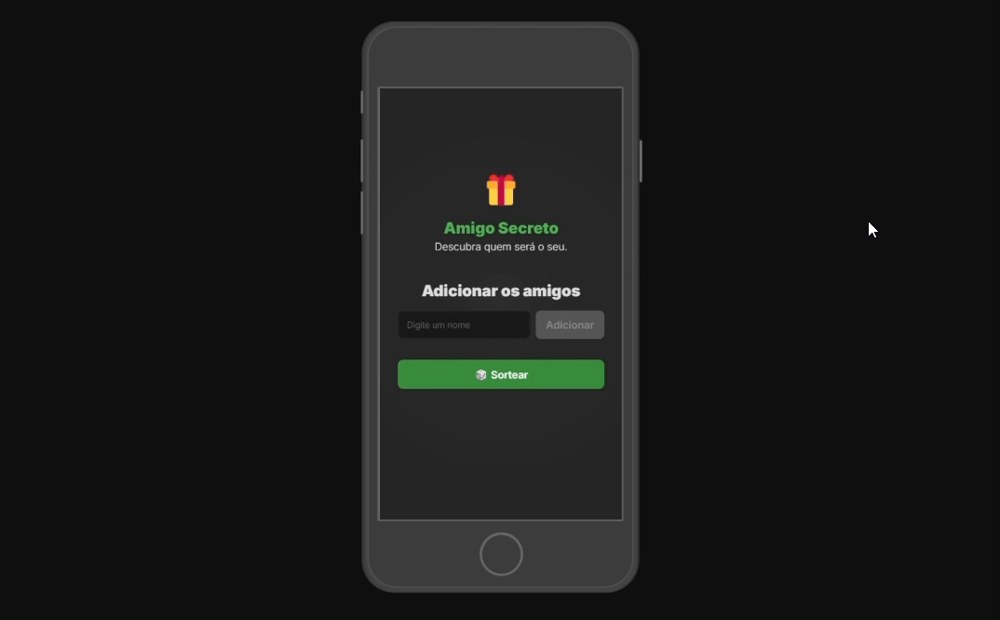

# 🎁 Amigo Secreto

> Um aplicativo web interativo para sorteio de amigos secretos.

## 📷 Demonstração

  


## 🌍 Acesse o Projeto Online

🔗 [Clique aqui para acessar o Amigo Secreto](https://matheusvazdata.github.io/challenge-amigo-secreto/)

## 🚀 Funcionalidades

- ✅ Adição e remoção de participantes  
- 🎲 Sorteio aleatório entre os participantes  
- 📱 Interface moderna e responsiva  
- ⚠️ Alertas interativos para informar ações inválidas  
- 🔒 O botão "Adicionar" só fica ativo se houver algo digitado

## 📋 Requisitos

- Navegador atualizado (Google Chrome, Firefox, Edge, etc.).

## 🛠️ Tecnologias Utilizadas

- **HTML** → Estruturação do projeto  
- **CSS** → Estilização e responsividade  
- **JavaScript (ES6+)** → Lógica do sorteio e interações dinâmicas  

## 📂 Estrutura do Projeto

📦 challenge-amigo-secreto  
├── 📂 assets  
│   ├── versao-mobile.png  
│   ├── gif-challenge.gif  
├── 📜 index.html  
├── 📜 style.css  
├── 📜 app.js  
└── 📜 README.md  

## 🎲 Como Executar o Projeto Localmente

1. Clone este repositório:<br>
   ```sh
   git clone https://github.com/matheusvazdata/challenge-amigo-secreto.git

2. Navegue até a pasta do projeto: <br>
   ```sh
   cd challenge-amigo-secreto

3. Abra o arquivo `index.html` em seu navegador.

<br>

Desenvolvido por **Francisco Matheus Vaz dos Santos**: [Linkedin](https://www.linkedin.com/in/matheusvazdata/) | [Data Portfolio](https://www.datacamp.com/portfolio/matheusvazdata)